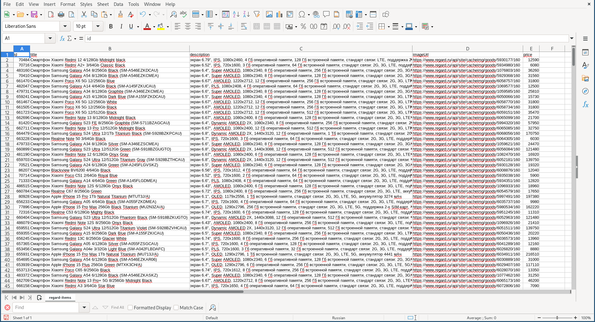

# Парсер товаров с маркетплейса [regard.ru](https://regard.ru/)

## Описание проекта
Программа запускается из консоли. Парсинг товаров выполняется по 5 столбцам:
- id товара (id)
- название товара (title)
- описание товара (description)
- фотография товара (imageUrl)
- цена товара (price)

Результат парсинга сохраняется в файле `regard-items.csv`в CSV формате.

## Запуск приложения
1. Убедитесь, что на Вашей машине установлен JDK версии 17 и выше:
```console
java --version
```

Скачать можно, например, [отсюда](https://www.oracle.com/java/technologies/downloads/).

2. Скачайте готовый бинарник `regard-parser.jar`:
   https://github.com/TheDuke2021/regard-parser/releases/download/v1.0.0/regard-parser.jar
3. Запустите бинарник, передав в качестве аргумента в двойных кавычках запрос, по которому нужно парсить, например:
 ```console  
java -jar regard-parser.jar "смартфон"
```

В той же папке, где находится `regard-parser.jar`, создастся новый файл `regard-items.csv`, в котором будут сохранены результаты парсинга в формате CSV.

## Указание дополнительных параметров
Можно указать количество товаров, которые нужно спарсить, используя аргумент `--count` или `-c`. Если этот аргумент не указан, по умолчанию будет парситься 500 товаров.
Если на сайте Regard товаров по указанному запросу меньше, чем `count`, парсер спарсит столько товаров, сколько есть.
```console
java -jar regard-parser.jar --count 10 "утюг"
```

## Возможные ошибки
Если отправлять слишком много HTTP-запросов на сайт Regard, он на некоторое время (несколько секунд) заблокирует доступ к сайту (429 HTTP код). Чтобы решить эту проблему, можно было бы использовать пул прокси и отправлять запросы с них. На текущий момент предлагается подождать пару секунд, пока блокировка не снимется.

## Сборка из исходников
Для компиляции и сборки проекта из исходников у Вас должно быть установлено:
1. JDK версии 17 и выше
2. Maven

Чтобы собрать проект из исходников, выполните следующие действия:
1. Склонируйте репозиторий:
```console
git clone https://github.com/TheDuke2021/regard-parser.git
```
2. Перейдите в склонированную папку
3. Запустите сборку:
```console
mvn clean verify
```

В папке `target` создастся файл `regard-parser.jar`, который запускается так же, как описано в [Запуск приложения](#Запуск-приложения).